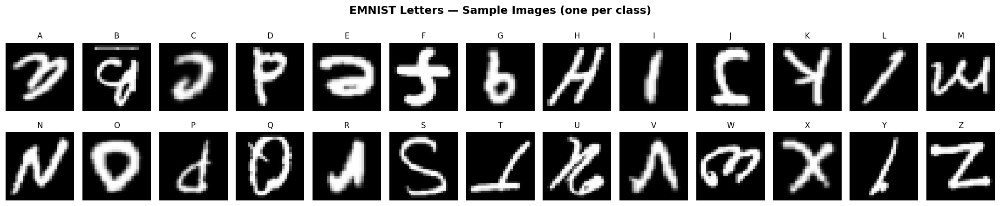
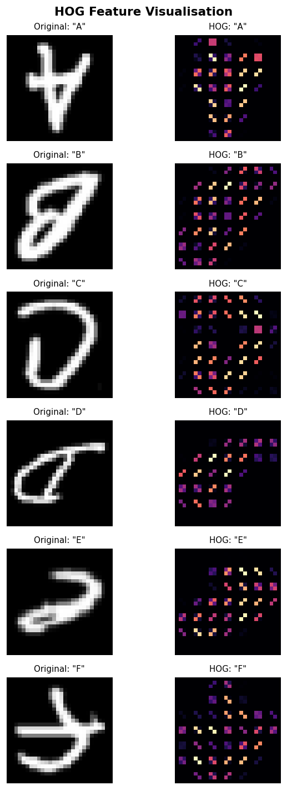
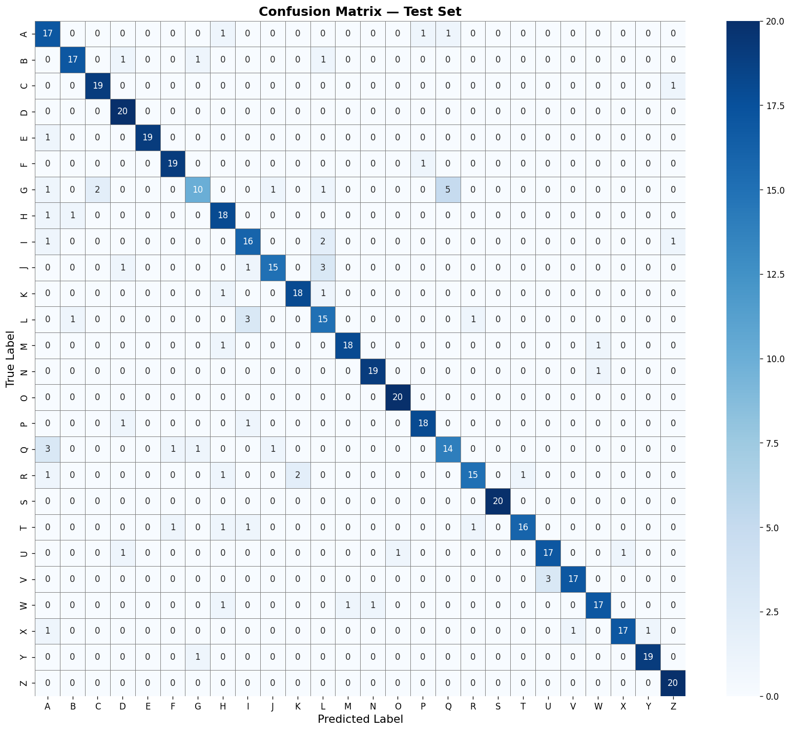
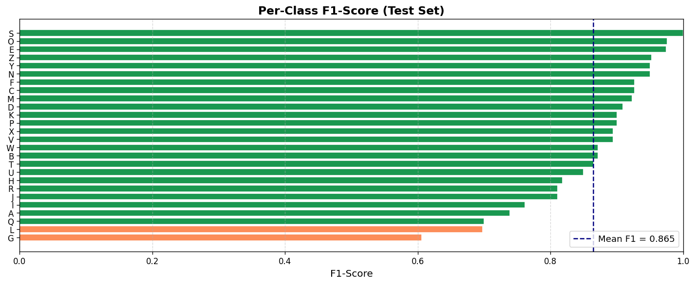
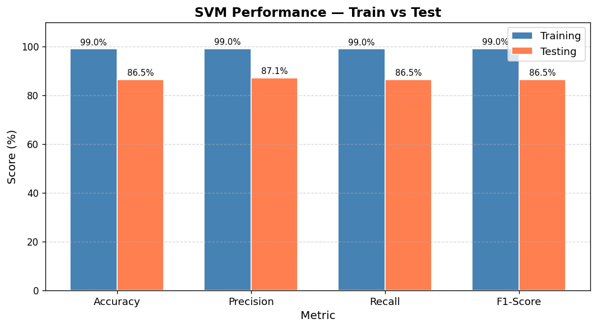
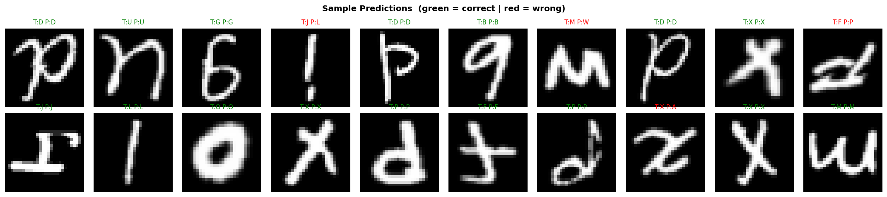

# 🔡 EMNIST Handwritten Character Classification
### HOG Feature Extraction + Support Vector Machine (SVM)

<div align="center">

[](https://www.python.org/)
[](https://scikit-learn.org/)
[](https://jupyter.org/)
[](LICENSE)

<br/>

**[▶️ Watch Full Explanation on YouTube](https://youtu.be/xjsalGC-DD0)**

<br/>

> Midterm Project — Machine Vision (RE604) · Politeknik Batam · Genap 2024/2025

</div>

---

## 📌 Overview

This project implements a complete **machine learning pipeline** for classifying handwritten letters (A–Z) from the [EMNIST Letters dataset](https://www.kaggle.com/datasets/crawford/emnist/data). The pipeline combines classical computer vision techniques with a supervised classifier:

```
Raw CSV Data  →  Dataset Sampling  →  HOG Features  →  SVM (Grid Search)  →  Evaluation
```

**Key results:**

| Metric | Training Set | Test Set |
|--------|:------------:|:--------:|
| Accuracy | 98.99% | **86.54%** |
| Precision | 99.01% | 87.07% |
| Recall | 98.99% | 86.54% |
| F1-Score | 99.00% | 86.46% |

---

## 📂 Project Structure

```
ComputerVision_Assignment/
│
├── images/
│   ├── confusion_matrix.png
│   ├── hog_visualization.png
│   ├── metrics_comparison.png
│   ├── per_class_f1.png
│   ├── sample_images.png
│   └── sample_predictions.png
│
├── MNIST_LetterDataset/
│   ├── emnist-letters-train.csv
│   └── emnist-letters-test.csv
│
└── SourceCode/
    └── Aldon_emnist_classification.ipynb
```

---

## 🗄️ Dataset

- **Source:** [EMNIST (Extended MNIST) — Kaggle](https://www.kaggle.com/datasets/crawford/emnist/data)
- **Split used:** `emnist-letters-train.csv`
- **Format:** CSV — column 0 = class label (1–26 → A–Z), columns 1–784 = pixel values (28×28 image)
- **Subset used:** **2,600 samples** — 100 samples per class × 26 classes (balanced)

> ⚠️ The CSV files are not included in this repository due to file size (~1 GB). Download them from the Kaggle link above and place them inside `MNIST_LetterDataset/`.

### Sample Images (A–Z)



---

## 🔍 HOG Feature Extraction

**Histogram of Oriented Gradients (HOG)** captures local edge and gradient structure — highly effective for shape-based recognition tasks like handwritten letters.

| Parameter | Value | Reason |
|-----------|:-----:|--------|
| `orientations` | **12** | Finer gradient direction bins (default: 9) |
| `pixels_per_cell` | **(4, 4)** | Smaller cells for finer local detail on 28×28 images |
| `cells_per_block` | **(2, 2)** | Local contrast normalization |
| `block_norm` | **L2-Hys** | Robust normalization against illumination changes |
| `transform_sqrt` | **True** | Reduces effect of large gradients |

Each 28×28 image → **1,728-dimensional HOG feature vector**

### HOG Visualization



---

## ⚙️ SVM Classifier & Grid Search

A **Support Vector Machine (SVC)** was used as the classifier. To find the best hyperparameters, **Grid Search with 5-fold Cross-Validation** was applied across 31 parameter combinations.

**Search space:**

| Parameter | Values tested |
|-----------|--------------|
| `kernel` | `rbf`, `linear`, `poly` |
| `C` | `0.1`, `1`, `10`, `100` |
| `gamma` | `scale`, `auto`, `0.001`, `0.01` |
| `degree` (poly only) | `2`, `3` |

**Best parameters found:**

```python
SVC(kernel='poly', C=1, degree=2, gamma='scale', class_weight='balanced')
```

**Best Cross-Validation Score: 83.22%**

---

## 📊 Evaluation

The dataset was split **80% training / 20% testing** (stratified), following the LOOCV evaluation principle outlined in the assignment.

### Confusion Matrix



### Per-Class F1-Score



### Metrics Comparison (Train vs Test)



### Sample Predictions



---

## 🚀 How to Run

### 1. Clone the repository
```bash
git clone https://github.com/<your-username>/ComputerVision_Assignment.git
cd ComputerVision_Assignment
```

### 2. Install dependencies
```bash
pip install scikit-image scikit-learn pandas numpy matplotlib seaborn jupyter
```

### 3. Download the dataset
- Go to: https://www.kaggle.com/datasets/crawford/emnist/data
- Download and extract the ZIP
- Place `emnist-letters-train.csv` and `emnist-letters-test.csv` inside `MNIST_LetterDataset/`

### 4. Run the notebook
```bash
cd SourceCode
jupyter notebook Aldon_emnist_classification.ipynb
```
Then select **Cell → Run All**.

---

## 📦 Dependencies

| Library | Version | Purpose |
|---------|---------|---------|
| `scikit-learn` | ≥ 1.8 | SVM, Grid Search, metrics |
| `scikit-image` | ≥ 0.26 | HOG feature extraction |
| `numpy` | ≥ 2.2 | Array operations |
| `pandas` | ≥ 3.0 | CSV loading |
| `matplotlib` | ≥ 3.10 | Visualization |
| `seaborn` | ≥ 0.13 | Confusion matrix heatmap |

---

## 🎥 Video Explanation

A full walkthrough of the code, methodology, and results is available on YouTube:

<div align="center">

[](https://youtu.be/xjsalGC-DD0)

</div>

Topics covered in the video:
- Dataset processing and orientation fixing
- HOG feature extraction and parameter tuning
- SVM classification with Grid Search
- LOOCV evaluation methodology
- Analysis of results and confusion matrix

---

## 📋 Assignment Info

| Field | Detail |
|-------|--------|
| Course | Machine Vision (RE604) |
| Program | Teknik Robotika — Politeknik Batam |
| Semester | Genap 2024/2025 |
| Lecturer | Eko Rudiawan Jamzuri |
| Student | Aldon |

---

<div align="center">
<sub>Made with 🤖 scikit-learn · scikit-image · Jupyter</sub>
</div>
